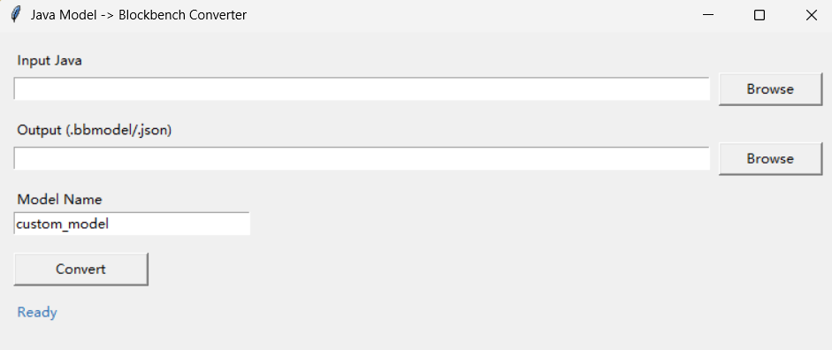

[简体中文](readmeL/readme_zh_cn.md) [繁体中文](readmeL/readme_zh_tw.md) [日本語](readmeL/readme_ja.md) [русский язык](readmeL/readme_ru.md)

# LTX-Customizer

Convert Minecraft Java model code (`PartDefinition / CubeListBuilder`) into Blockbench-importable `.bbmodel` / `.json`.



## Features

- GUI mode (pick input/output files and convert with one click)
- CLI mode
- Output includes `elements` (with `faces` UV) and `outliner` hierarchy
- Supports both `CubeDeformation.NONE` and `new CubeDeformation(...)`

## Requirements

- Python 3.10+
- Windows / macOS / Linux (`tkinter` is required for GUI)

## Quick Start

```powershell
python main.py
```

This opens the GUI. Choose input Java file and output `.bbmodel`/`.json`, then click `Convert`.

## CLI

```powershell
python main.py <input.java> [output.bbmodel/json] [model_name]
```

Example:

```powershell
python main.py dark_latex_yufeng.java custom_model.bbmodel
```

## Build EXE

```powershell
python -m pip install pyinstaller
python -m PyInstaller --noconfirm --clean --onefile --windowed --name LTX-Customizer main.py
```

Output:

- `dist/LTX-Customizer.exe`
